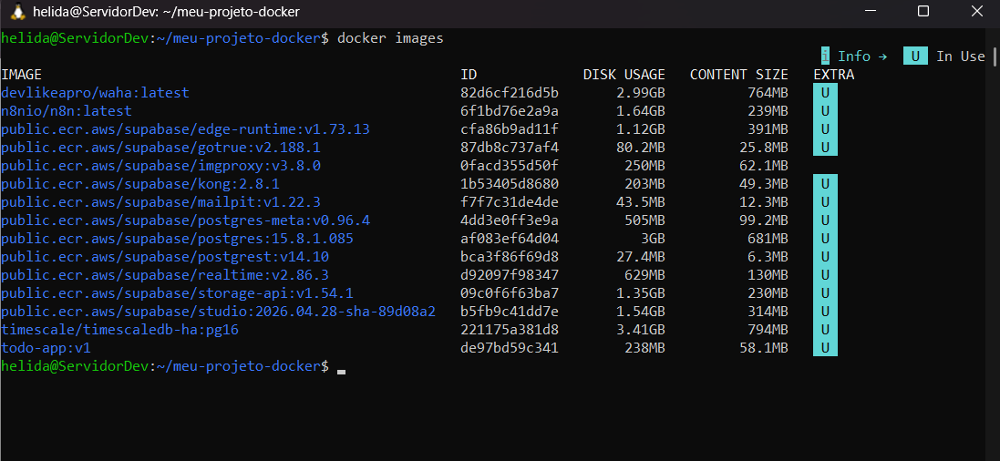
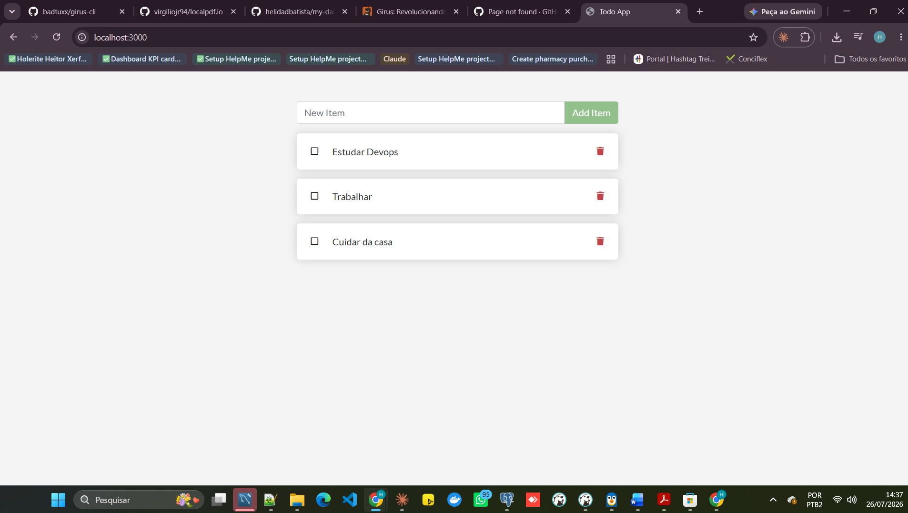
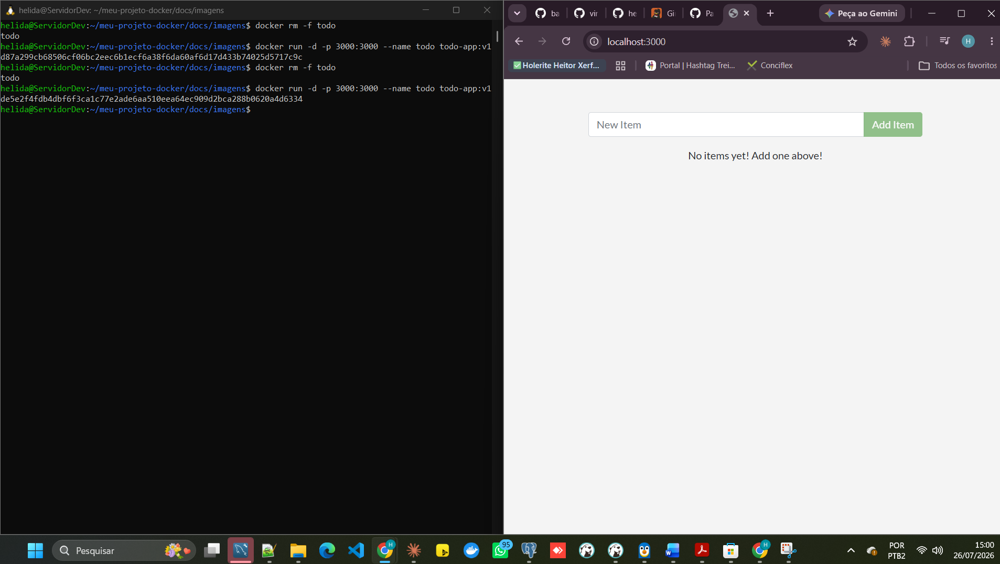
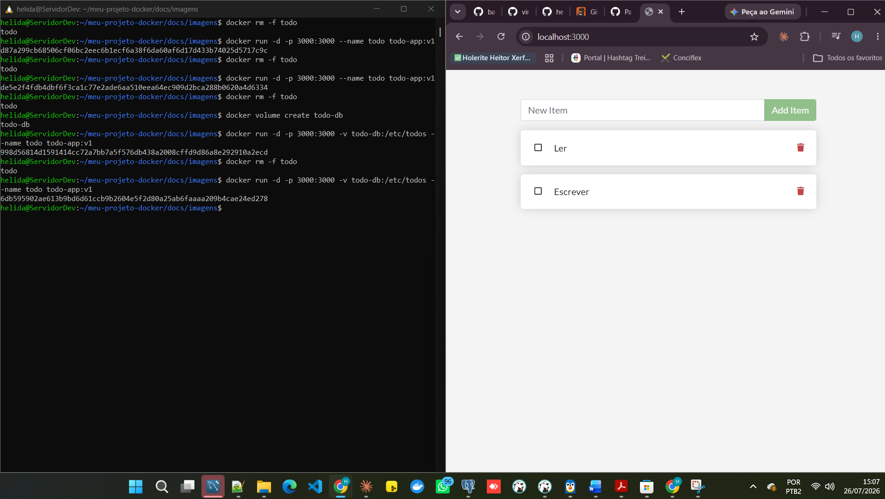
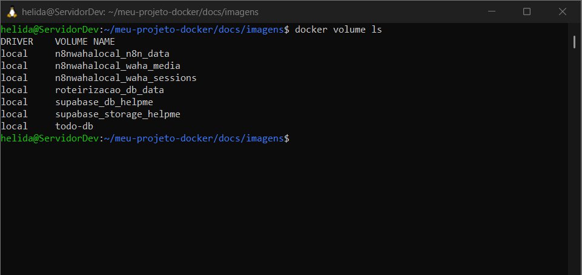
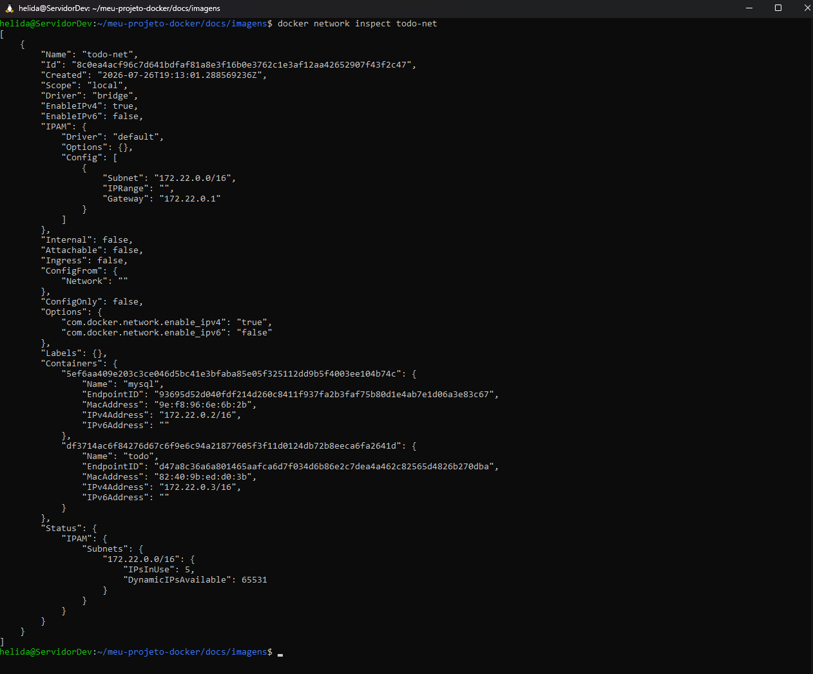
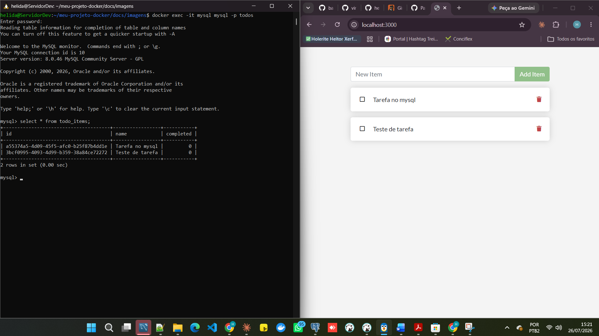
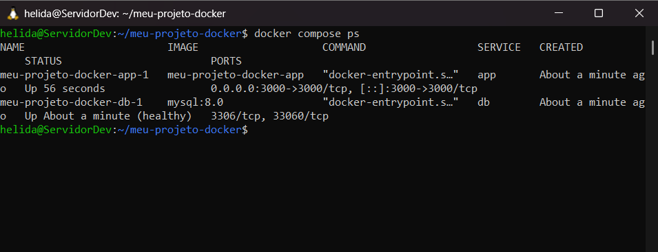
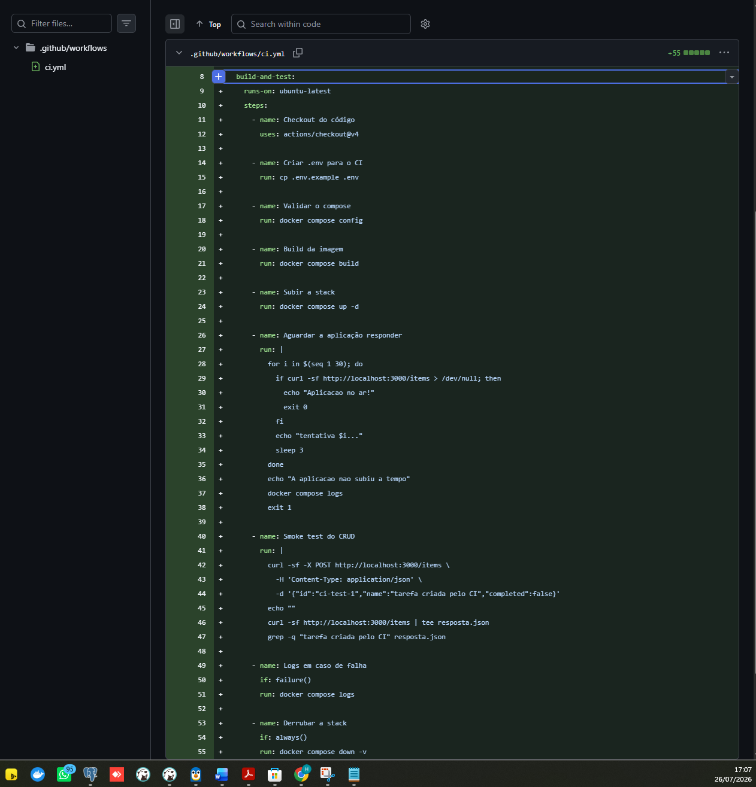
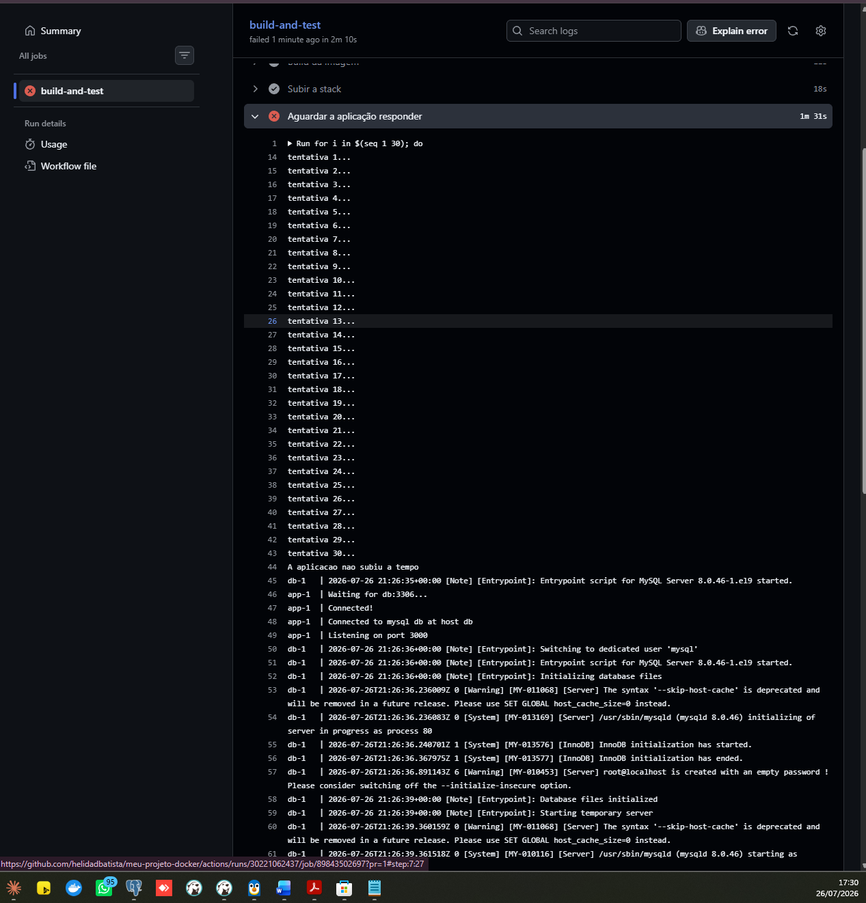

# Atividade Docker + CI — Hélida Dias Batista Xerfan

Aluno(a): Hélida Dias Batista Xerfan
Turma: Vespertino
Data: 26/07/2026
Aplicação usada: docker/getting-started-app — To-Do em Node.js

## 1. Como executar este projeto

git clone https://github.com/helidadbatista/meu-projeto-docker.git
cd meu-projeto-docker
cp .env.example .env
docker compose up -d --build

Acessa em: http://localhost:3000

Para derrubar: `docker compose down` (mantém os dados) ou `docker compose down -v` (apaga tudo, inclusive o banco).

## 2. Imagem e Dockerfile multi-stage

Estágios utilizados: builder (instala as dependências com npm ci) e o estágio final (só copia o que já foi instalado + o código, sem levar nada do processo de build).

Imagem base: node:20-alpine
Usuário de execução: node, não-root
Tamanho final da imagem: 238MB

Por que o multi-stage ajuda: porque o estágio de build fica de fora da imagem final — só vai pra imagem o que realmente precisa rodar em produção. Isso deixa a imagem mais leve e com menos coisa instalada, o que também diminui a chance de ter alguma vulnerabilidade parada ali sem necessidade.

Print 1 — build + docker images

Print 2 — aplicação rodando com tarefas cadastradas

## 3. Volumes e persistência

Volume usado: todo-db → montado em /etc/todos

Testei sem volume primeiro: cadastrei tarefas, destruí o container e subi de novo — a lista voltou vazia, porque o banco morreu junto com o container. Depois refiz o teste usando o volume nomeado e, dessa vez, ao recriar o container as tarefas continuaram lá, porque os dados ficaram salvos no volume, que existe independente do container.

Print 3 — SEM volume: dados perdidos ao recriar o container

Print 4 — COM volume: dados preservados

Evidência extra — docker volume ls mostrando o volume todo-db:

Diferença entre docker compose down e docker compose down -v: o primeiro remove os containers mas mantém os volumes (os dados sobrevivem); o segundo remove os containers e também apaga os volumes, então os dados somem de vez.

## 4. Rede

Rede criada: todo-net
Serviços conectados: app e db
A porta do banco está exposta ao host? Não — o container do banco não usa -p/ports, então só quem está dentro da rede todo-net consegue falar com ele, ninguém de fora acessa direto.

Por que o app consegue chamar o host mysql / db sem saber o IP? Porque o Docker cria um DNS interno dentro de cada rede que a gente cria — todo container que está nessa mesma rede consegue ser encontrado pelo nome (ou pelo alias), sem precisar saber o IP de ninguém. O Docker resolve isso por trás dos panos.

Print 5 — docker network inspect

Print 6 — dados dentro do MySQL (select * from todo_items;)

## 5. Docker Compose

Serviços: app, db
Rede: todo-net · Volume: todo-mysql-data
Healthcheck em: db · depends_on com: condition: service_healthy
Variáveis sensíveis: carregadas via .env (não versionado). Modelo em .env.example.

Testei a persistência com o Compose também: cadastrei tarefas, rodei docker compose down (sem -v) e subi de novo — as tarefas continuaram lá. Depois rodei docker compose down -v e subi de novo — a lista voltou vazia, confirmando que o -v apaga o volume junto.

Print 7 — docker compose ps

## 6. Integração Contínua (GitHub Actions)

Arquivo do workflow: .github/workflows/ci.yml
Gatilhos: push e pull_request
O que o pipeline faz:
1. valida o compose
2. builda a imagem
3. sobe a stack
4. aguarda a app responder e testa criar uma tarefa via API
5. derruba a stack

Print 8 — execução verde

## 7. Quebra proposital do CI

O que eu quebrei: troquei a rota testada no smoke test de /items para /itemsss (uma rota que não existe) na etapa "Aguardar a aplicação responder" do workflow.

Erro que apareceu no log: A aplicacao nao subiu a tempo — depois de 30 tentativas de curl na rota /itemsss, nenhuma teve sucesso.

Como o CI reagiu: o step "Aguardar a aplicação responder" falhou depois de esgotar as 30 tentativas (com sleep de 3s entre elas), porque o curl -sf nunca conseguia bater na rota certa.

Como eu corrigi: voltei a rota para /items no arquivo .github/workflows/ci.yml, commitei e dei push na mesma branch — o Actions rodou de novo automaticamente no PR e ficou verde.

Link do Pull Request: https://github.com/helidadbatista/meu-projeto-docker/pull/1

Print 9 — execução vermelha + log do erro

## 8. Dificuldades e aprendizados

No começo travei bastante em coisas básicas de terminal — editar arquivo pelo nano, entender por que o container morria com erro de permissão no /etc/todos, e depois configurar autenticação do Git pra conseguir dar push. O que mais me ajudou foi olhar sempre o docker logs quando alguma coisa dava errado, em vez de tentar adivinhar. Ficou bem mais claro pra mim como container, volume e rede são coisas separadas: o container é só o processo rodando, os dados de verdade ficam no volume, e a rede é o que permite os containers se acharem pelo nome sem eu precisar descobrir IP nenhum.

## 9. Checklist de autoavaliação

- [x] Dockerfile multi-stage funcionando
- [x] .dockerignore presente
- [x] Container não roda como root
- [x] Volume nomeado + persistência demonstrada
- [x] Rede nomeada + banco não exposto ao host
- [x] compose.yaml sobe tudo com um comando
- [x] .env no .gitignore e .env.example versionado
- [x] CI verde
- [x] PR com CI vermelho documentado
- [x] Todos os 9 prints no README